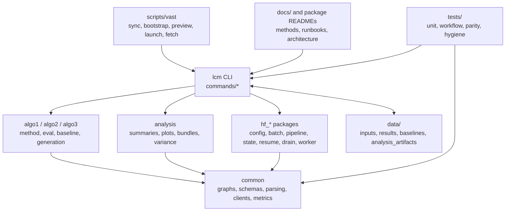
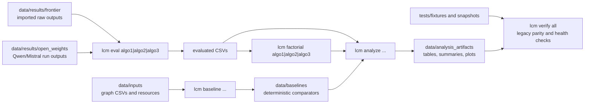
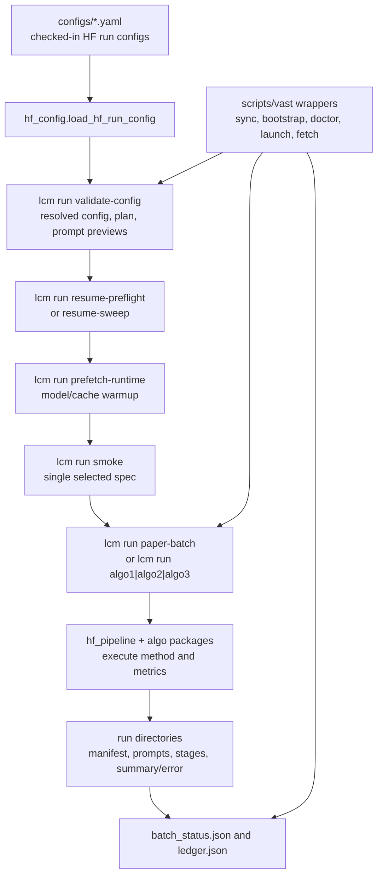
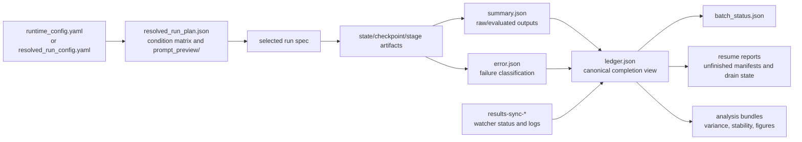
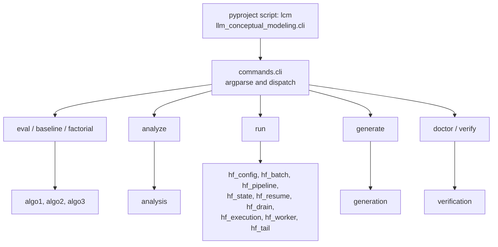
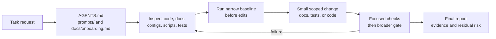

# Architecture

This document is implementation-oriented. For project context, reproducibility commands, and reviewer-facing usage, see [README.md](/Users/noeflandre/variability-conceptual-modeling/llm-conceptual-modeling/README.md).

## Design Goals

The codebase is organized around three requirements:

- deterministic research workflows should be reproducible from the command line
- shared logic should be centralized where behavior is actually identical
- correctness should be externally checkable through fixtures, schemas, and verification commands

## Package Layout

- `src/llm_conceptual_modeling/algo1`, `algo2`, `algo3`
  Algorithm-specific entry points and behavior that remains distinct across the three study workflows.
- `src/llm_conceptual_modeling/common`
  Shared graph loading, connection evaluation, factorial-analysis helpers, CSV schema checks, literal parsing, and typed data structures.
- `src/llm_conceptual_modeling/commands`
  CLI handlers. These modules keep argument wiring separate from the domain logic so workflows remain directly testable.
- `data/inputs`
  Input graph files referenced by the generation-manifest layer.
  The canonical copy is published in the Hugging Face bucket.
- `data/results/frontier`
  Imported frontier-model experiment outputs grouped by algorithm.
- `data/results/open_weights`
  Canonical paper-facing Qwen/Mistral outputs and variance-decomposition artifacts.
- `data/results/archives`
  Preserved OLMO artifacts and operational workdirs retained for provenance.
- `data/analysis_artifacts`
  Reproducible audit artifacts derived from `data/results` for revision support.
  The canonical copy is published in the Hugging Face bucket.
- `tests/fixtures/legacy`
  Committed oracle artifacts used for parity verification.

## Workflow Model

The repository implements three command families:

- `lcm eval ...`
  Convert raw algorithm outputs into evaluated CSVs.
- `lcm factorial ...`
  Compute factorial-analysis summaries from evaluated CSVs.
- `lcm baseline ...`
  Generate deterministic structural baseline raw outputs for each algorithm.
- `lcm analyze ...`
  Produce reviewer-facing post-processing artifacts such as grouped descriptive summaries, replication-stability summaries, paired hypothesis tests, tidy figure exports, baseline comparisons, and raw-output failure classifications.

For the paired hypothesis-test workflow, adjusted p-values use Benjamini-Hochberg correction. That choice matches the repository's use case better than a familywise-error correction: the tests are emitted in related families across metrics and files, and the purpose is to control false discoveries while retaining enough sensitivity to inspect potentially real effects in the imported corpus.
- `lcm verify ...`
  Run repository health checks and deterministic parity checks.

The `lcm generate ...` commands expose the experiment contract for each algorithm in their default form. When given explicit model, pair, and output-root arguments, they also execute the corresponding live-backed Mistral experiment path for that algorithm.

The `lcm baseline ...` commands are also intentionally narrow. They expose deterministic graph and lexical heuristics, including WordNet-based ontology matching and edit-distance ranking. These baselines are auditable comparators, not substitutes for provider-backed generation.

## Repository Diagrams

These diagrams are intentionally coarse. They show the maintained code paths and
artifact boundaries without listing every helper module, test file, or generated
CSV.

### High-Level Architecture

### Data-Flow Pipeline

### Experiment Lifecycle

### Artifact And Cache Lifecycle

### CLI And Module Map

### Agent Workflow

## Verification Strategy

The verification model is layered:

- unit and workflow tests protect parsing, graph logic, schemas, failure modes, and output contracts
- golden and parity fixtures check that deterministic outputs remain stable
- `lcm doctor` checks basic repository prerequisites
- `lcm verify legacy-parity` reruns the offline workflows against committed oracle artifacts
- `lcm verify all` provides a single machine-readable gate for local work and CI

This structure is intended to make regressions visible quickly and to keep future manuscript-driven changes inside short verification loops.

## Explicit Boundary

The repository does not currently validate historical live LLM behavior by reissuing the exact legacy provider calls. Instead, the generation layer now exposes both offline manifests and live-backed Mistral execution paths that reproduce the paper's method structure against the imported data and tracked inputs.

This boundary is deliberate: the code and verification surface remain in GitHub, while the canonical experimental data payload is externalized to the Hugging Face bucket. Offline outputs are reproducible and regression-tested, whereas live provider behavior may drift across model versions, serving infrastructure, and time.
